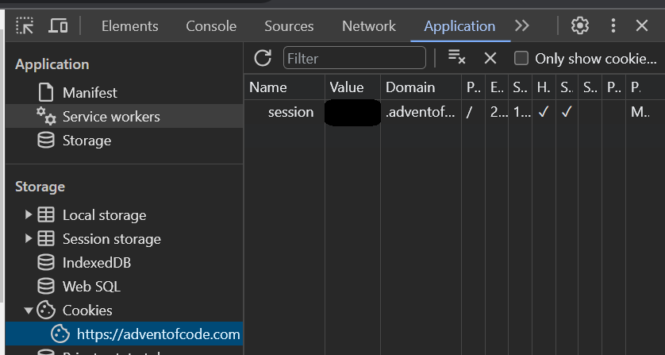

# Speech-Driven Coding 🗣️
Create/iterate on code using natural language. An AI-Human collaboration 🕵️💻✨.

Built for hands-free, accessible coding via dictation.

## Integrations

### [Advent of Code](https://adventofcode.com): Automated Puzzle-Solving
Focus on developing solutions instead of logistics & coding minutiae like parsing.

Automates the whole process, so you can dictate everything using the CLI.

Automates:
- Downloading inputs.
- Creating files.
- Running code.
- Submitting answers.

Note: AI should not be used for AOC submissions impacting leaderboards. For more info, see https://adventofcode.com/about.

## Usage
### Python Dependencies
```
python -m pip install langchain
python -m pip install openai
```

### OpenAI API Key
First, [create your key](https://platform.openai.com/api-keys).

Then:

- Modify this line in *config.py*:
```
OAI_API_KEY='<your-key>'
```

OR

- Set an environment variable like:
```
export OAI_API_KEY='<your-key>'
```

### Optional: Advent of Code Session Key
This allows automation of downloading input and submitting answers.

1. Login to [adventofcode.com](https://adventofcode.com)
2. Get your session key from inspecting the webpage:
- Open the Inspector (CTRL + SHIFT + C).
- Copy the cookie value called "session" in Application > Cookies


3. Modify config:
- Modify this line in *config.py*:
```
AOC_SESSION_KEY='<your-key>'
```

OR

- Set an environment variable like:
```
export AOC_SESSION_KEY='<your-key>'
```
